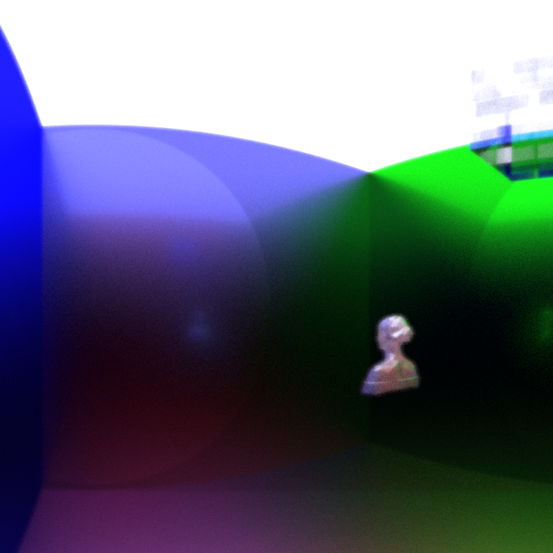

# A (at the moment) quite bad raytracer

It does work though, so we go that going for us. Built in pure C.  

Our goal with this project was to build a raytracer from scratch, without following a guide, and only referencing the minimum amount of math we couldn't figure out ourselves.

### Ideas:
Tree model for scenes (see branch scene_tree)
- each leaf box has 12 object triangles.
- arbritrary number of node boxes from box head to leaf
- ensures minimum level of collision checks for large, high triangle scenes

~~~~
                box
              /     \          split down x-axis
           box       box
          /   \     /   \         split down z-axis
        box   box  box  box
         |     |    |    |           (would split down y-axis, then loop back to x for additional nodes)
        tri   tri  tri  tri
        tri   tri  tri  tri
        tri   tri  tri  tri
        tri   tri  tri  tri
        tri   tri  tri  tri
        tri   tri  tri  tri
        tri   tri  tri  tri
        tri   tri  tri  tri
        tri   tri  tri  tri
        tri   tri  tri  tri
        tri   tri  tri  tri
        tri   tri  tri  tri
~~~~
